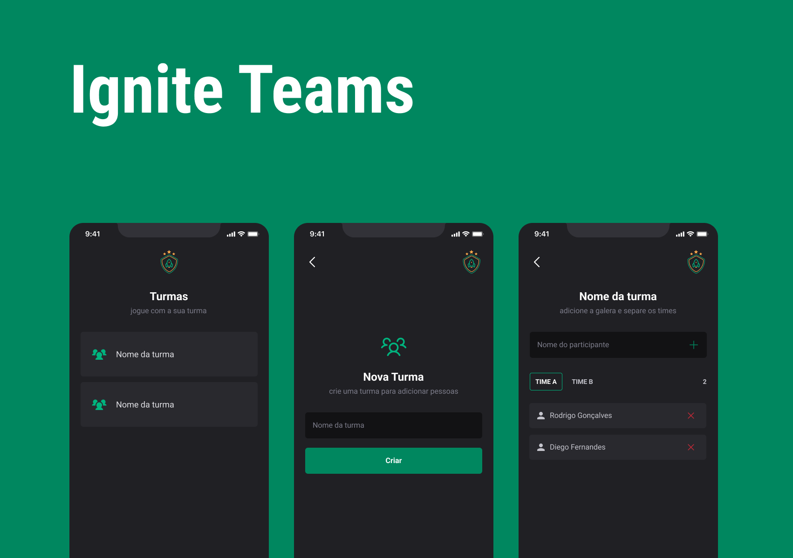

<h1 align="center">
  
</h1>

# Sobre o projeto

<p>
  A ideia do projeto é para galera que gosta de jogar. Na aplicação é possível criar um turma e adicionar jogadores separados em Time A e Time B.
</p>

# Tecnologias

- [React Native](https://reactnative.dev/)
- [TypeScript](https://www.typescriptlang.org/)
- [Expo](https://expo.dev/)
- [Async Storage](https://docs.expo.dev/versions/latest/sdk/async-storage/)
- [Styled Components](https://styled-components.com/)
- [React Navigation](https://reactnavigation.org/)
- [Phosphor Icons](https://phosphoricons.com/)

## Como baixar o projeto

```bash
# Clonar o repositório
$ git clone https://github.com/wellingtonrodriguesbr/ignite-teams.git

# Entrar no diretório
$ cd ignite-teams

# Instalar as dependências
$ npm install

# Rodar o projeto
$ expo start
```

<br/>
<hr/>

<p align="center">Desenvolvido por <a href="https://www.linkedin.com/in/wellingtonrodriguesbr/" target="_blank">Wellington Rodrigues</a> ✌🏽</p>
